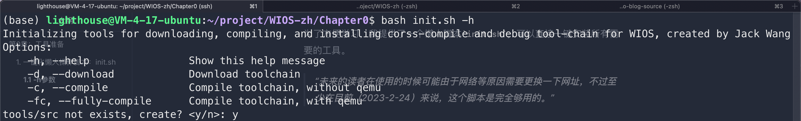
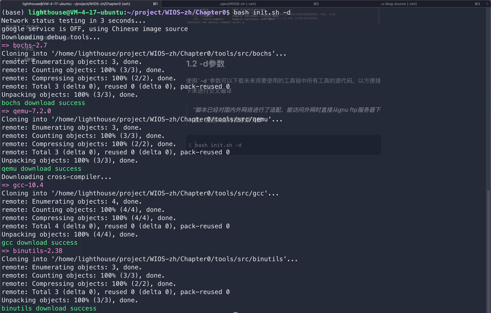
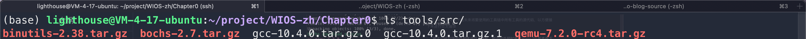
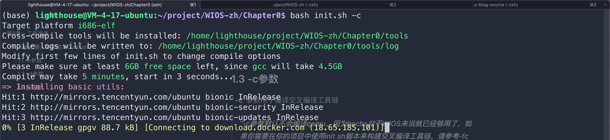
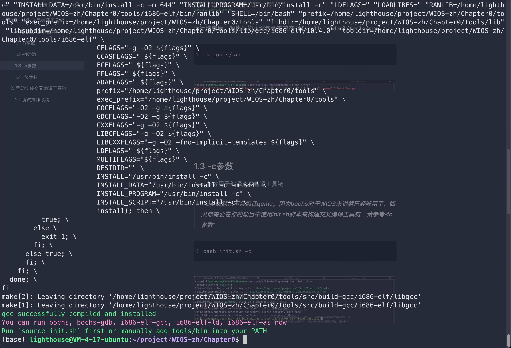
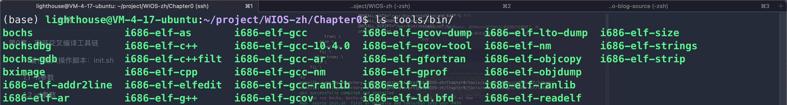
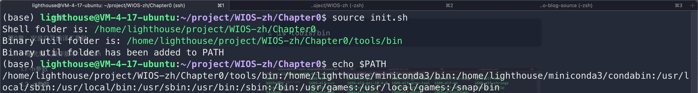
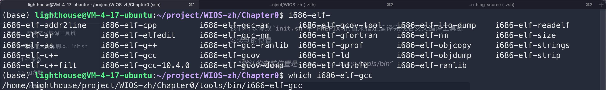
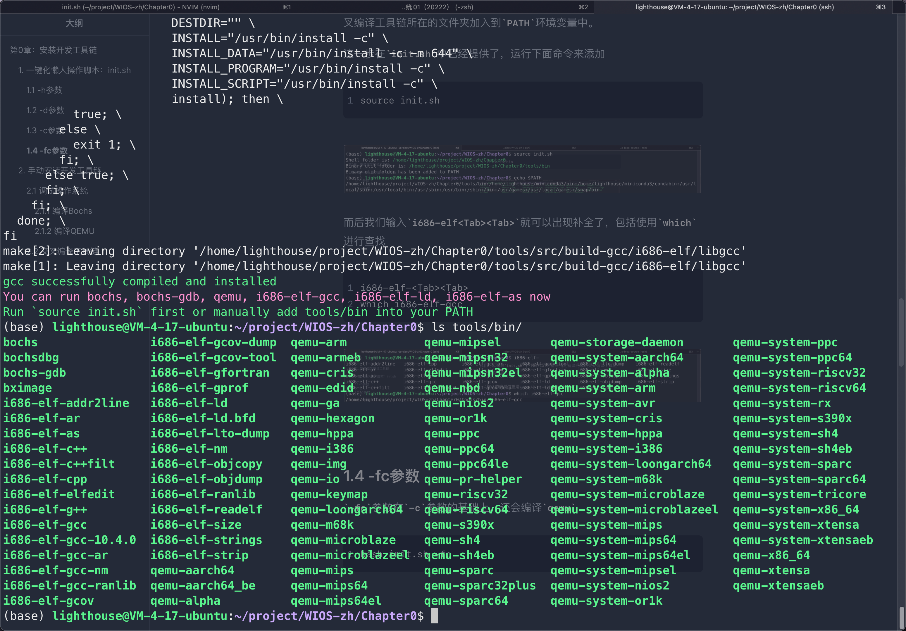

# 第0章：安装开发工具链 

为了编写一个操作系统，我们需要准备一系列的工具，本章将会安装他们。这些工具统称为开发工具链。

> 严格来说，内核不等于操作系统。操作系统 =内核+外围服务（例如：提供GUI服务的X Windows系统)。但是我会交替使用OS和内核这两个词。**在本书中，我不区分内核和操作系统之间细微的语义差异，我将它们视为同一事物** 。 

开发工具链主要包括**交叉编译工具链**和**调试虚拟机**。

> [下面](#cc)将介绍什么是交叉编译

## 1. 开发工具链介绍

### 1.1 开发流程

在接下来的几章中，开发我们内核的过程是：

- 编写内核代码
- 编译内核
- 调试内核  


#### 1.1.1 编写内核代码：编辑器

对于编写代码，有一堆编辑器供我们使用，例如` VSCode `、` Vim `、` gedit `、` nano `、` Emacs`等。这些编辑器中的每一个都有能力编写内核。选择你喜欢的编辑器即可。


#### 1.1.2 编译内核：交叉编译器

> <span id="cc">为什么我们需要交叉编译？</span>

简而言之，**编译内核需要一个针对目标平台的交叉编译工具链**。 

**CPU是一种硬件，或者说是一组复杂的电路**。这组复杂电路可以识别指令并激活不同的子电路。不同的子电路起着不同的作用，一些子电路可以访问内存，一些子电路与8259A芯片（一种可编程中断控制器，我们将在以后的章节中介绍）连接，并处理来自8259A的中断。

CPU的电路设计决定了其能够识别哪些指令，一个CPU支持的所有指令加在一起称为指令集。想象一下，如果不同的CPU支持不同的指令集，那别编写程序就会成为一场灾难。功能相同的程序在不同的CPU上因为CPU的指令集不同得反复写很多遍。因此，为了解决这个问题，各种CPU的指令中有几个指令集是被广泛接受，例如：`x86`指令集、`arm`指令集等等。**在未来，厂商新设计CPU的时候，新设计出来的电路应该能够识别这些指令集并实现指令集中规定好的功能，即新设计的CPU必须兼容这些指令集**。

**就像有有不同代的CPU一样，诸如`x86`这样的指令集也有不同的版本**。一般而言，新版本的指令集是兼容与早期版本的，即早期版本的指令集是新版本指令集的子集。**因此，基于早期指令集设计的CPU一般是无法运行新指令集的部分指令的。**

正是因为CPU和指令集之间存在对应关系，，如果我们要编写一个在`Intel 80686`CPU上运行的操作系统，那么操作系统的指令应该与`Intel 80686`兼容。 

说到指令就存在一个问题了，我们写的C语言代码是字母，而CPU电路的设计决定了它只能识别01000100001110这样的二进制指令序列。CPU不能识别字母组成的代码。那么该如何让CPU运行我们的代码？ 

**答案是编译**。编译类似于翻译。编译器（例如`gcc`、`clang`等）会根据语法将字母级别的源代码翻译成能够实现相同功能的、CPU可识别的二进制指令序列。**因此在编译后，字母级别的源代码（文本文件）成为由二进制指令组成的程序（二进制文件）。程序其实就是指令组成的序列**

**既然程序是由指令组成的序列，那么程序的指令就和指令集有关了**。例如`arm`的编译器会生成`arm`指令集中的指令组成的程序，而`x86`的编译器会生成`x86`指令集中的指令组成的程序。类似于我们用中文写成的文章，翻译软件A将文章翻译成相同意思的英文文章，而翻译软件B将文章翻译成相同意思的法语文章。

CPU能够识别对应的指令集中的指令，而程序又是由某个指令集中的指令组成的。**如果程序的指令来自的指令集并不是CPU能够识别的指令集，那么CPU就无法运行这个程序**。

举例来说，**CPU只能运行由能够识别的指令组成的程序**。同样的C源代码，如果我们使用生成`arm`指令的编译器，生成的程序无法在`x86`架构的CPU（即只能识别`x86`指令的CPU）上运行。因为`x86`架构的`CPU`既不能识别`arm`指令，也没有相应的电路实现。 

因此，如果我们使用一台`Intel` CPU的计算机来开发一个运行在`arm` CPU上的内核。我们需要一个能够在`Intel` CPU上运行，但生成由`arm`指令组成的程序的编译器。**这种编译器被称为交叉编译器，因为它的宿主平台（编译器运行的平台）与目标平台（生成的程序运行的平台）不同。** 

对于`WIOS`来说，我们设计的目标是它将在`Intel 80686`CPU上运行，所以我们需要一个在我们的计算机上运行的、能够生成可以被`Intel 80686`CPU识别的指令的交叉编译器。 

幸运的是，`gcc`完美的切合了我们的需求，我们可以将其作为交叉编译器来编译我们的内核。但是注意，不要`yum install gcc`或者`apt install gcc`。因为`yum install`和`apt install`本质上都是下载别人编译好的`gcc`。这样的`gcc`默认目标平台就是宿主平台，即使用这种`gcc`编译出来的程序只能在你的电脑上跑，而使用这种`gcc`编译的内核不能在`Intel 80686` CPU上运行。

所以我们需要编译一个新的`gcc`，编译得到的新的`gcc`能够在我们的计算机上运行并且生成目标平台兼容的指令组成的程序。


#### 1.1.3 调试内核：虚拟机

通过交叉编译（即使用交叉编译器编译源代码的过程），我们得到了一个由`Intel 80686`CPU兼容的指令组成的内核。既然内核也是由编译器生成的程序，那么就不可避免我们需要对其进行debug，那么我们该如何运行、调试这样的内核？

首先交叉编译得到的内核是由`Intel 80686` CPU指令组成的，所以它当然能够运行在装有`Intel 80686` CPU的电脑上。但我相信大多数人都没有`Intel 80686`这样的古董级CPU。

所以，我们其实是虚拟机来模拟得到一个装有`Intel 80686` CPU的计算机，然后在这个虚拟的计算机上运行我们的内核。内核不关心我们到底有没有一个实体的机器，它只关心指令能不能被CPU解释和执行。而虚拟机可以让我们更先进的CPU伪装成早期的CPU，例如让`Intel i9-10900k` CPU通过识别`Intel 80686` CPU的指令从而实现伪装。毕竟`Intel i9-10900k`是基于更新的指令集设计的，当然兼容`Intel 80686`的指令集。


## 2. 手动编译、安装开发工具链

虽然后面我提供了一个一键下载、编译开发所需要的所有工具的bash shell，但我还是推荐读者阅读这一节，这一节中还是介绍了一些知识的

### 2.1 编辑器

随便啥都行，只要你喜欢就好。对我来说，我更喜欢用`VSCode`，因为未来我们需要编写C和汇编代码。


### 2.2 交叉编译器

交叉编译器主要包含 `binutils` 和 `gcc`两部分

首先下载`binutils`和`gcc`的源代码

```shell
wget https://ftp.gnu.org/gnu/binutils/binutils-2.38.tar.gz
wget https://ftp.gnu.org/gnu/gcc/gcc-10.4.0/gcc-10.4.0.tar.gz
```

> 你也可以访问https://ftp.gnu.org/gnu/binutils/ 和 https://ftp.gnu.org/gnu/gcc/，下载其他版本

接下来，在编译和安装之前声明一些环境变量。 

```shell
export PREFIX=<the-location-where-cross-compiler-will-be-installed>
export TARGET=i686-elf
export PATH="$PREFIX/bin:$PATH"
```

> WIOS将在`Intel 60686` CPU上运行，所以我们将目标平台设置为`i686-elf`。

接下来，编译并安装`binutils`

```shell
tar xzvf binutils-x.y.z.tar.gz

mkdir build-binutils
cd build-binutils
../binutils-x.y.z/configure --target=$TARGET --prefix="$PREFIX" --with-sysroot --disable-nls --disable-werror
make
make install
```

> 这里的`x.y.z`是版本号，把它其替换为你下载的`binutils`的版本号

最后，编译并安装`gcc`.

```shell
tar xzvf gcc-x.y.z.tar.gz

# The $PREFIX/bin dir _must_ be in the PATH. We did that above.
which -- $TARGET-as || echo $TARGET-as is not in the PATH

mkdir build-gcc
cd build-gcc
../gcc-x.y.z/configure --target=$TARGET --prefix="$PREFIX" --disable-nls --enable-languages=c,c++ --without-headers
make all-gcc
make all-target-libgcc
make install-gcc
make install-target-libgcc
```

> 这里的`x.y.z`是版本号，把它其替换为你下载的`gcc`的版本号


### 2.3 虚拟机

我们上面说到，我们将使用虚拟机来模拟目标平台并调试我们的内核。

目前我们可以使用的虚拟机软件有很多，比如`VMware`、`Virtualbox`等等。 但是像`VMWare`这样的虚拟机软件侧重于运行一个操作系统，而不是一步一步地单步调试操作系统。

因此，我们需要的是提供了调试接口的虚拟机软件，能够让我们去单步调试我们的内核。 目前，一些流行的支持调试操作系统的虚拟机软件有`Bochs`和`QEMU`。`Bochs`相比之下更加轻量，但`QEMU`更加强大。对于`WIOS`而言，`bochs`和`QEMU`都完全够用了。 


> 在接下来的几章中，我会用`Bochs`调试我们的内核，因为我更熟悉`Bochs`


#### 2.3.1 编译Bochs

首先下载源代码 

```shell
wget https://sourceforge.net/projects/bochs/files/bochs/2.7/bochs-2.7.tar.gz
```

> 你也可以下载`SourceForge`上的`Bochs`托管的其他版本的源代码：https://sourceforge.net/projects/bochs/files/bochs/.

然后安装编译时需要的依赖项：

```shell
sudo apt-get install build-essential xorg-dev libgtk2.0-dev bison
```

接下来，编译并安装`Bochs`：

```shell
sudo tar xvzf bochs-2.7.0tar.gz
cd bochs-2.7.0
# 以下配置编译的bochs不支持gdb调试，只能使用bochs自带的调试器。
./configure-prefix = installation directory-enable-debugger-enable-iodebug-enable-x86-64-with-x-with-X11.
# 以下配置编译的bochs支持gdb调试。可以在vscode中使用gdb或gdb来链接bochs调试。
./configure-prefix = installation directory-enable-GDB-stub-enable-iodebug-enable-x86-64-with-x-with-X11.
make
make install
```

> 如果不指定`--PREFIX`参数，默认情况下，它将被安装到`/usr/bin `文件夹中，此时需要使用` sudo make install`来进行安装


#### 2.3.2 编译QEMU

`QEMU`的编译比`Bochs`简单得多。 

首先下载源代码：

```shell
wget https://download.qemu.org/qemu-7.2.0.tar.xz
```

然后解压缩、编译并安装QEMU：

```shell
tar xvJf qemu-7.2.0.tar.xz
cd qemu-7.2.0
./configure
make
```

> `QEMU`使用`ninja`作为构建系统，因此不需要执行`make install`命令。`ninjia` 将会安装  `QEMU` 


## 3. 一键懒人脚本：init.sh

为了方便学习，我提供了一个懒人脚本`init.sh`，可以直接一键安装所有需要的工具。

> 未来的读者在使用的时候可能由于网络等原因需要更换一下网址，不过至少在目前（2023-2-24）来说，这个脚本是完全够用的。


### 3.1 -h参数

使用`-h`参数可以获得脚本的帮助信息

```shell
bash init.sh -h
```




### 3.2 -d参数

使用`-d`参数可以下载未来将要使用的交叉编译工具链中所有工具的源代码，以方便接下来编译得到所有交叉编译时用到的工具

> 脚本已经对国内外网络进行了适配，能访问外网时直接从gnu ftp服务器下载，否则从国内镜像源下载

```shell
bash init.sh -d
```



运行结束后，源代码的压缩包会被放在`${shell_folder}/tools/src`下

```shell
ls tools/src
```




### 3.3 -c参数

`-c`参数用于编译交叉编译工具链

> -c参数默认不会编译qemu，因为bochs对于WIOS来说就已经够用了，如果你需要在你的项目中使用init.sh脚本来构建交叉编译工具链，请参考-fc参数

```shell
bash init.sh -c
```





我们可以修改`init.sh`中`PREFIX`的值来指定编译完成后交叉编译工具链安装到的位置

> 默认的安装位置是：`<path-to-WIOS>/tools/bin`

```bash
ls tools/bin
```



为了我们能够在命令行中直接调用交叉编译工具链中的工具，我们还需要把交叉编译工具链所在的文件夹加入到`PATH`环境变量中。

这一步在`init.sh`中已经提供了，运行下面命令来添加

```shell
source init.sh
```



而后我们输入`i686-elf<Tab><Tab>`就可以出现补全了，包括使用`which`进行查找

```shell
i686-elf-<Tab><Tab>
which i686-elf-gcc
```




### 3.4 -fc参数

`-fc`参数在`-c`参数的基础上，还会编译`qemu`

```shell
bash init.sh -fc
```


