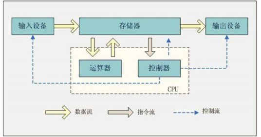
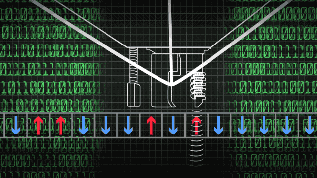
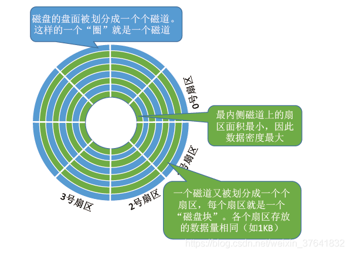
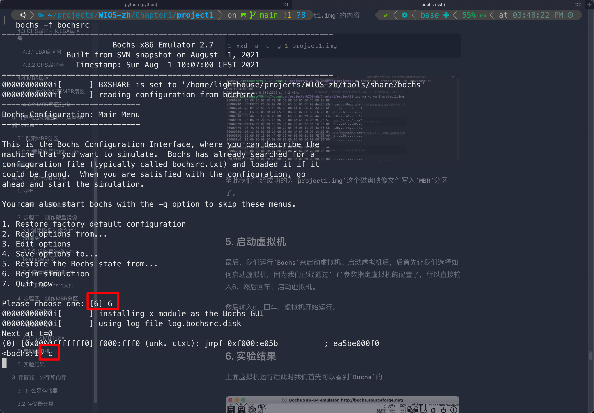
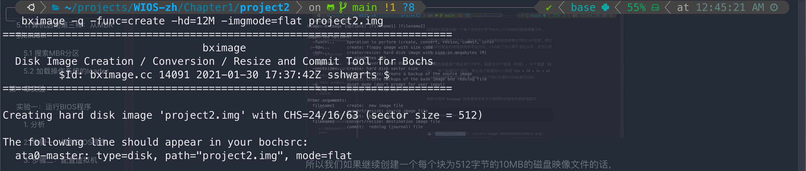

# 第一章：计算机的组成与启动

本章我们将开始编写操作系统的第一步：启动计算机。为了，我们需要先学习计算机的硬件组成。

> 为了便于没有基础的人也能看懂，我尝试使用最简单的语言来进行解释，因此会存在诸多不严谨之处，请有深厚功底的读者谅解

本章部分资源引用自[`BiliBili`谭玉刚老师的课程](https://www.bilibili.com/video/BV1dz4y1z7e4?vd_source=214871085a518d6559a5be7d13ee2374)

## 1. 计算机的硬件组成

> 操作系统是和硬件紧密结合的软件，因此在编写操作系统前，我们需要对计算机的硬件有足够的了解

`CPU`不是一个可以单独工作的部件。`CPU`只负责进行计算，但是计算的数据、计算得到的结果需要存储到外存；计算的结果需要通过显示器显示给用户；还需要用户通过键盘和鼠标输入需要计算的数据……

因此，`CPU`只是电脑的一个组件，`CPU`需要内存、显卡、键盘、鼠标等等的设备支持，此外还需要供电、散热等等支持才能够正常的运行。

`CPU`的背部有很多的金属触点，这些金属触点就是 `CPU`的供电来源、地址线、数据线等等。这些金属触点，我们称之为 `引脚`。

`CPU`和鼠标、键盘、硬盘、显示器等等设备之间的数据交互就是通过这些触点完成的。


**而为了把 `CPU`和内存、硬盘、屏幕还有鼠标键盘连接在一起，让数据能够互相流通，人们设计了一块可以连接所有设备的电路板，这个板子就是 `主板`（`Mother Board`）**


不仅电脑中有 `主板`，手机上也有 `主板`，乃至于微波炉、洗衣机等等设备或者由计算机控制的设备上，都有 `主板`。只不过手机上的和微波炉、洗衣机中的主板比电脑上的主板小得多的说，而且连接到上面的设备也少的多得多。

**`主板`实际是多层电路的堆叠，层与层之间用绝缘胶相互隔绝。因此主板中每一层都可以视为是不同的电路，或者说具有特殊功能的导线**。


主板上预留了很多的底座。因此，`主板`就可以将各种各样的设备连接起来。


所以我们如果要把 `CPU`连接到当前 `主板`上去的话，那么我们只需要把 `CPU`放到 `主板`上的 `CPU插槽`中，那么 `CPU`就通过底部的N多个金属触点，连接到了 `主板`上N多个导线上。


同理，`主板`上也提供了 `内存插槽`，我们把 `内存`插到 `内存插槽`上，那么通过主板内部的某一层电路，`CPU`就和内存建立了联系，他们之间就可以交换数据了


而为了显示，我们插上显卡，并且连接显示器


为了获取用户输入输出，我们插上鼠标键盘


当然，如果没有电，那么计算机是没有办法工作的，而CPU工作的第一个要求就是有供电。所以我们还需要给主板接上电，所以还需要给主板接上电源模块。


最终，一台像模像样的计算机就搭建起来了。

> 上面其实是对计算机的硬件组成的最简单的介绍。其实主板上还集成了不少芯片，例如：中断控制器、仲裁器（虽然说是器，但其实就是一个芯片）……
>
> 未来我们会一一进行介绍，学习是一个由浅入深的过程，我们先介绍简单的、容易理解的内容。有难度的、不容易理解的内容后面我们会慢慢讲解

## 2. 计算机启动第一棒：接通电源

> 有人可能会问，计算机开机不是应该在按下电源键之后才开始的么？错了，其实计算机开机在接通电源之后就已经开始了

我们接下来将讲解开机的第一步：`接通电源`。

### 2.1 什么是接通电源

有人可能会问，为什么连接通电源都要讲，难道接通电源不就是把计算机的插头插到插座上么？错了，其实针对台式机这种没有内部供电的计算机，把插头插到插座上是接通电源。

而对于手机、笔记本这种有内置供电的计算机，只要电池接上计算机那就是接通电源。

总之，在我们为计算机接通电源的那一刹那，电力供应就源源不断的来到了主板，但是此时，电力还没有输送到各个硬件上。


### 2.2 第一步：时钟芯片上电

在接通电源之后，上电的第一个模块就是计算机中的 `时钟模块`。**`时钟模块`是一种特殊的电路，只要接通电源，电路就会发出 `高——低——高——低`的信号**。

这个信号称为 `时钟信号`，主板上不同的芯片，只要检测时钟信号中的上升沿，就可以同步的进行操作。例如CPU在检测到第一个上升沿后就开始计算机一次加法，然后在这个时钟周期内完成计算，并在下一次检测到上升沿后在下一个时钟周期保存计算结果到内存。

这样通过时钟信号就实现了让整个系统中的所有的电路同步运行。（计算机中的电路其实是异步时钟电路，这里主要是为了方便讲解）


时钟电路主要由时钟发生器(时钟芯片)、14.318MHz晶振、电容、电阻和电感等组成。当然，**我们这里不需要知道时钟电路具体是如何实现的，我们这里需要明白的是，计算机中各个电路和硬件想要正常工作就需要先有时钟信号。所以接通电源之后第一个开始工作的模块就是时钟模块**。

**但是注意，时钟芯片上电只是表示时钟芯片准备好工作，正式开始工作，向各个硬件发出不同频率的信号还得等我们按下开机键**


#### 2.3 第二步：开机电路工作

时钟电路上电之后，接下来开始工作的就是开机电路了。此时计算机中的其他硬件，例如显卡、内存什么的都还没有上电。

开机电路的主要功能，就是侦测我们是否按下了开机键，在我们按下了开机键之后，开机电路导通了，而后开机电路就会向主板发送一个开机信号。

在接收到开机信号之后，主板就会向各个设备供电，此后就开启了我们原先理解的开机流程。


## 3. 计算机启动第二棒：按下开机键后

我们上面介绍了接通电源后，按下开机键之前计算机系统发生的事情。接下来我们讲解接通电源后、按下开机键之后发生的事情。

### 3.1 第一步：硬件自检

在我们按下了开机键后，当开机电路侦测到了我们按下开机键，这个时候主板就会接收到我们按下了开机键这个信号。

而主板在接收到按下开机键的信号后，会检查自己身上有没有短路、漏电的部分，如果有则会中断开启并且切断供电，没有则继续供电，继续开机流程。

在供电自检完成300~500毫秒后，电源会发出一个 `PowerGood`信号，时钟芯片在接收到这个信号后，就会开始工作，向主板上的各个部件发出不同频率的时钟信号。

### 3.2 第二步：CPU上电复位

在时钟开始发出时钟信号后，接下来供电就会来到各个设备上。而设备在获得供电后的第一件事就是复位。其中就包括了 `CPU`。

这里之所以要强调 `CPU`，是为了和下一章节的内容形成呼应，我们在下一章会详细介绍 `CPU`的工作机制。


`CPU`复位的时候会初始化 `CS`、`IP`寄存器，即将 `CS`、`IP`的值设置为某一个特定的值。具体是怎么复位的，其实还是硬件电路实现的。类似于时钟电路能够发出时钟信号，CPU的复位电路能够将 `CS`、`IP`设定为特定的值。

> 在前面我们说过，未来debug我们自己写的操作系统的时候，我们会使用虚拟机模拟一台计算机出来。而虚拟机的模拟就是从我们按下开机键开始，所以我们未来会用虚拟机来查看 `CS`和 `IP`具体被设置成什么值了

### 3.3 第三步：各个部件复位

在时钟芯片开始向各个部件输出时钟信号后，不仅仅是 `CPU`会初始化，主板上的各个部件也会开始初始化。

> 我们上面是为了给后面开始运行操作系统铺垫，所以强调了 `CPU`的复位。

### 3.4 第四步：运行BIOS程序

在主板上所有的硬件复位之后，`CPU`此时就可以开始运行了。但是这个时候有一个问题，我们该运行那个程序？

因为我们现在的计算机都是冯·诺依曼模型。**而冯诺依曼模型的计算机中，`CPU`（运算器和控制器）只负责取指令、解释指令、运行指令。而指令都是储存在内存（存储器）中的。**



更简单的解释是，`CPU`只负责计算（加减乘除），而下一个时钟周期计算的到底是加法、减法、乘法还是除法是由存储在内存中的指令决定的。`CPU`在开始计算前是需要到内存中去读取下一个指令，从而才能开始下一次计算。

> 我自己在钻研的时候一直很异或 `CPU`是如何取指、解释、执行的，为什么 `CPU`能取指、解释、执行？后来才醒悟过来，这其实是CPU的硬件电路设计所决定的。
>
> 也不要问为什么冯诺依曼体系结构是 `CPU`取指执行、指令存储在存储器。这其实是冯诺依曼体系结构计算机的定义。只要你费尽千辛万苦后设计出来的硬件电路只要满足冯诺依曼体系结构的要求，那么你设计的计算机就是冯诺依曼体系结构计算机中的一种。

可是，内存在复位后，其中是没有任何指令的。换而言之，在复位后，内存中是没有任何程序的，那么这个时候 `CPU`到底该运行那个程序呢？

**所以，这个时候我们就需要在计算机中内置一套程序，这个程序的作用就是把其他的程序从磁盘读取到内存中，此时内存中就有了新的程序。最后该程序结束运行，并让 `CPU`去执行新的程序即可。**

并且由于内存断电后其中的数据就没了，所以这个程序必须要在主板断电后依旧存在。这个程序就是 `基本输入输出系统`（`Basic Input Output System`，`BIOS`）。这个程序的名字很怪，但是本质上他和我们用的QQ、微信没什么区别，都是指令序列。

上个世纪70年代，人们发明了一种称为 `ROM`（`Read Only Memory`）的芯片，`ROM`芯片和内存（`RAM`芯片，`Random Access Memory`）一样，可以被 `CPU`读取，但是其中的数据在断电之后不会丢失，并且 `CPU`也不能向 `ROM`中写入数据。

所以，`ROM`天然就适合存储 `BIOS`程序。现在的主板上专门有一个 `ROM`芯片用于存储 `BIOS`程序。久而久之 `BIOS`有的时候指代的是开机时启动的程序，有时候又指代这个存储了 `BIOS`程序的芯片。


> 关于CPU到底是如何访问存储在 `ROM`中的程序的，我们在未来的章节中进行讲解

`BIOS`运行的最后，会在磁盘上寻找操作系统，找到了就会把操作系统从磁盘中读取到内存，而后就开始运行操作系统。


而在此之后，我们就正式接受了计算机的启动流程，此后计算机是怎么启动的，就取决于我们所编写的操作系统代码。

> 读这里，请读者完成[实验一：运行BIOS程序](#project1)
>
> 实验一将会帮助读者对 `BIOS`有一个直观的感受

## 4. 磁盘与MBR扇区

我们上面说到，`BIOS`运行到最后会在磁盘上寻找操作系统。所以下面我们首先讲解磁盘和磁盘映像。然后再讲解 `MBR`扇区

### 4.1 磁盘与磁盘映像

**磁盘是一种能够用于存储二进制数据的部件**。在物理上不同类型的磁盘有不同的存储原理，例如传统的机械磁盘使用磁性物质的磁极南北来表示01，固态硬盘通过电子的多少来表示01。

> 早期计算机使用的磁盘是 `软磁盘`（`Floppy Disk`，简称 `软盘`），如今常用的磁盘是 `硬磁盘`（`Hard disk`，简称 `硬盘`，或者 `机械硬盘`）。
>
> 本文后续会交替使用 `磁盘`、`硬盘`或者 `机械硬盘`来指代 `硬磁盘`

但是不管具体存储的原理是什么，磁盘在逻辑上都是一样的，都是0101010的二进制数据串。



**那么如果现在有一个二进制文件，这个文件中每一个二进制位的值都和磁盘中的对应的二进制位的数据一样。那么在逻辑上，这个二进制文件就和这个磁盘是等价的。**

未来如果我们向磁盘中保存一些文件，从而修改了一些二进制位的值。如果我们通过技术手段保证这个和磁盘对应的二进制文件相应的位发生同样的变化。那么这个二进制文件就可以被视为是磁盘。

这样的二进制文件就像镜子中所映射出来的物体的像和物体是一模一样的的一样，因此称为 `磁盘映像文件`（`Disk Image`），简称为磁盘映像。

因此，对于虚拟机来说，我们就可以用磁盘映像去模拟磁盘。未来我们也会把操作系统写入磁盘映像，从而模拟把系统烧录到U盘/安装到磁盘中。

### 4.2 扇区

我们说到磁盘在逻辑上就是一个很长的二进制数据串，例如我们现在常见的$1TB$的硬盘能存储$8796093022208$个字节的数据。

如果我们把这个硬盘想象成一个很长的纸带，那么我们现在如果要改变某一位的值的话，我们就得说将第$991029129$个二进制位的值修改为1。我们就会发现这样非常的不方便。

**因此，为了方便对磁盘的读写，在逻辑上我们把磁盘切分为一个一个的磁盘块，称为 `扇区`（Sector），又称为块（Block）**。每个 `扇区`的大小都相同，一般是512个字节。当然，由于不断提高的磁盘大小，部分厂商设定每个扇区的大小是4096字节。

> 后面没有强调的话，我们默认一个扇区是512字节

**未来我们对磁盘进行操作的都是以扇区为单位的**。例如我们要读取第$991029129$个二进制位的值。一个字节8个比特，所以$991029129 / (512 \times 8 ) = 251950 \cdots1920$，$1920 / 8 = 240$即第$991029129$个比特位是第$251949$号扇区的第$239$个字节的最后一位。

所以我们从磁盘中直接讲第$251950$号扇区读入到内存中，然后对第$239$个字节与$1$按位与就能得到$991029129$位的值。

### 4.3 CHS扇区号和LBA扇区号

因为我们需要对磁盘进行访问，因此要对每个块/扇区进行编号，或者说**寻址（Addressing）**。

#### 4.3.1 LBA扇区号

最直接的编号方式就是从0号块开始，然后依次是1号块、2号块、3号块……这种对块编号的方式称为 `逻辑块寻址`（`Logical Block Addressing`，`LBA`）。

块和LBA编号是一一对应的，所以未来我们需要访问某个块的时候，我们主需要给定这个块的 `LBA`编号即可。因此这个 `LBA`编号其实就可以当做这个块的地址，我们通过这个地址，就可以找到这个块。因此这个 `LBA`编号其实就称为 `LBA`地址。这种根据 `LBA`地址循找对应块的方法，称为 `LBA`寻址。

`LBA`寻址中规定使用一个28位或者48位的二进制数字来表示块，对应的块地址称为 `LBA28`地址和 `LBA48`地址。

- `LBA28`最多能标识$2^{28}=268435456$个块，一个块512个字节，所以 `LBA28`能表示1TB大小的磁盘。
- `LBA48`最多能标识$2^{48}=281474976710656$个块，一个块512字节，所以 `LBA48`能标识1048576TB大小的磁盘

而我们的操作系统未来满打满算也才几MB，算上文件系统也不过100多MB。因此我们使用 `LBA28`来表示扇区就完全够用了。

> 有人可能会问，为什么我们给定一个LBA28地址，就能读取到对应块的内容，中间到底是怎么对应的？
>
> 答案是这是磁盘的电路设计决定的，对于我们使用者来说，我们不需要关心磁盘具体是怎么把LBA地址对应到具体得扇区的。我们只需要使用即可

#### 4.3.2 CHS扇区号

`CHS扇区号`是对扇区编号的另外一种方式。这种方式和磁盘的结构是相关的。

> 磁盘的结构

一个 `磁盘`（如一个 1T 的 `机械硬盘`）由多个 `盘片`（如下图中的 0 号盘片）叠加而成。盘片的表面涂有 `磁性物质`，这些磁性物质用来记录二进制数据。因为正反两面都可涂上磁性物质，故**一个盘片可能会有两个盘面**。

每个盘面都会有一个 `磁头`（`Head`）以从对应的盘面上读取数据。读取数据的时候是盘面旋转的同事磁头会前进后退，从而将磁头转到对应位置。然后再检测磁性物质是南极还是北极，从而得知当前位是0还是1。


每个盘片被划分为一个个 `磁道`，每个磁道又划分为一个个 `扇区`（Sector）。

> 注意，这里的扇区号和LBA中的扇区号不一样，CHS中每个盘面都会有一个0号扇区，而LBA中的0号扇区是唯一的



每个盘面对应一个磁头。所有的磁头都是连在同一个磁臂上的，因此所有磁头只能“共进退”。所有盘面中相对位置相同的磁道组成 `柱面`（`Cylinder`）。


因此，我们可以用 `（柱面号，盘面号，扇区号）`，即 `（Cylinder，Head，Sector）`来定位任意一个磁盘块。因为盘面和磁头是一一对应的，所以有的文章中也是用磁头号来表示盘面号的。

> 目前，使用较多的是LBA扇区号，包括我们的WIOS中也是使用LBA扇区号来访问磁盘的。

### 4.4 MBR扇区

#### 4.4.1 什么是MBR扇区

**主引导扇区（Master Boot Record，MBR）其实就是就是磁盘的第一个扇区，即第0号扇区。这个扇区中记录了当前磁盘的一些关键信息。BIOS通过读取这个扇区中的数据，从而得知操作系统在哪**。

#### 4.4.2 为什么要有MBR扇区

我们前面在计算机启动流程的中讲到，`BIOS`运行的最后一步就是在磁盘中寻找操作系统。那么就有一个问题，磁盘那么大，BIOS怎么在磁盘中找到操作系统？

假设我们的磁盘是1TB的，BIOS光是遍历这个1TB的磁盘就要就得花掉几分钟。所以肯定 `BIOS`寻找操作系统肯定就不是通过遍历的方式进行的。

事实上，`BIOS`是借助了 `MBR扇区`中的信息来寻找操作系统。

下面这张图就是存储了WIOS的前身JackOS的磁盘映像文件的 `MBR`扇区


#### 4.4.3 MBR扇区结构

`MBR`扇区本质上也是一个扇区，因此其能够存储512字节的数据。这512个字节的数据保存了当前硬盘的信息，因此每一个字节都很重要。

因此，人们对MBR扇区进行了细致的规划，每个字节都有不同的作用。具体的结构如下：


MBR扇区可以分为三部分：

- 0-445字节：这446个字节存储了可以运行的代码
- 446-509字节：这64个字节是分区表，分区表中表示了每个分区是否有操作系统
- 510和511字节：这两个字节固定为 `0x55AA`，标识当前磁盘中存在可启动的操作系统

## 5. 计算机启动第三棒：从MBR到Loader

第二棒的结尾，我们讲到 `BIOS`会在磁盘中寻找操作系统，但是因为我们没有讲磁盘的相关知识，所以上面我们补充了磁盘的相关知识。下面继续讲计算机启动第三棒。

### 5.1 搜索MBR分区

`BIOS`程序运行的最后，首先会检测当前计算机系统上连接了几个硬盘。然后会循环读取每个磁盘的第一个扇区到内存中来。

在讲 `MBR`扇区中的数据读取到内存中后，`BIOS`会检测读入的512个字节的最后两位是否是 `0x55AA`，即检测当前磁盘中是否存在一个可启动的 `MBR`操作系统

如果存在的话，那么 `BIOS`就会跳转到扇区的第0个字节处开始执行 `MBR`扇区中的程序

读到这里，请读者先做完下面的[实验二：运行MBR程序](#project2)


### 5.2 加载操作系统的loader

`BIOS`在磁盘中找到存在操作系统的磁盘之后，其使命就已经结束了。在这之后 `BIOS`就结束运行了，并在最后通过一个 `jmp`指令跳转到MBR程序，即CPU的使用权限交给MBR分区中的程序了。所以 `BIOS`运行结束之后，CPU就开始运行MBR分区中的程序了。

> 我们未来会通过实验去查看BIOS的最后一个jmp指令，别急，第一章的目的只是希望你了解计算机的开机流程，同时对编写操作系统感兴趣。如果觉得不错的话希望给我一个Star \^.\^

`MBR`分区中的程序是我们正式写的第一个程序。如果你完成了实验二，那么你你应该就会对这句话有很深刻体会。

但事实上，操作系统的启动是一个复杂的过程。单纯依靠MBR分区中446字节的代码实在是难以完成。所以我们的做法就是把整个操作系统的启动代码分为两部分，第一部分放在 `MBR`分区中，而后让 `MBR`分区中的代码去读取磁盘中第二部分的操作系统启动代码，最后再运行第二部分的操作系统启动代码，从而启动操作系统。**这也就是大名鼎鼎的操作系统两阶段启动模型**。

计算机按下开机键称为 `Power On`，而操作系统称为 `Boot`。所以这两部分启动的代码称为 `Boot Loader`。

虽然操作系统是通过这两段代码启动的，但是因为不同的操作系统具体启动的时候的设置不同，**所以操作系统的编写者必须提供启动自己写的操作系统的 `Boot Loader`**。这样别人通过使用你的 `Boot Loader`才能够启动你写的操作系统。我们将来也会为WIOS编写 `Boot Loader`。

也正是因为操作系统和 `Boot Loader`的一一对应，`Boot Loader`的代码也经常被视为是操作系统代码的一部分，从而就造成了操作系统启动操作系统这一个假象。也因此操作系统启动被称为 `Bootstarp`

> 英语里有一句谚语："pull oneself up by one's bootstraps"，意指不借助他人的帮助自己完成某些事情。所以操作系统的启动就被称为 `Bootstarp`，简称 `Boot`

经过上面的介绍，我们现在明白了，`MBR`分区中的代码最终的功能其实就是去磁盘中搜索、读取第二阶段启动的代码。第二阶段启动的代码完成了绝大部分启动操作系统前的准备。

在给出关于操作系统两阶段启动的实验前，我想还是先讲解一下计算机的运行模式，或者说CPU的运行模式和BIOS的功能。

如果不讲这些的话，操作系统两阶段启动的实验你做起来也是云里雾里的。所以下一章就将讲解CPU的运行模式和BIOS的功能。

本章至此结束。

# 第一章实验

下面是本章的实验，建议读者在指定的地方完成实验后再继续阅读。实验可以加深读者对我所讲述的知识的理解

> 完成实验前请先运行 `init.sh`文件安装所有的工具，并且运行 `source init.sh`

## `<span id="project1">`实验一：运行BIOS程序

实验一我们的目的就是就是运行一下 `BIOS`程序，以验证计算机开机之后会自动运行 `BIOS`程序。

### 1. 分析

我们不可能用一个真的计算机启动，然后查看运行的BIOS。并且未来我们需要调试操作系统，而如果使用一个实体机的话，我们是没有办法调试操作系统的。

因此，我们其实是要模拟计算机的启动流程。而虚拟机除了所有的硬件资源都是虚拟的以外，所有的行为，包括开机流程什么的，都和实体机一样。因此实验一中我们首先需要有一个虚拟机。

其次，我们的虚拟机也需要能够模拟BIOS。关于这个 `Bochs`其实能够实现。

因此，我们实验一最终要做的其实就是让 `Bochs`模拟一个虚拟机，而后我们开机即可。

### 2. 步骤一：模拟BIOS程序

`BIOS`本身就是一个软件，只不过这个软件是被固化在了主板的芯片上，再加上电路的设计，所以才保证了计算机开机之后运行的第一个程序就是 `BIOS`。

所以，说到底，`BIOS`就是一个软件。既然是一个软件，那么我们就可以在当前的系统中运行这个软件。

所以 `Bochs`其实提供了一个 `BIOS`的程序。就在 `Bochs`的安装位置下。

> `Bochs`提供的 `BIOS`程序地址是`$BXSHARE/BIOS-bochs-latest

`$BXSHARE`是 `Bochs`内建的宏。如果你使用的是前面的 `init.sh`脚本一键配置的话，那么 `$BXSHARE`的值就是 `<path-to-WIOS>/tools/share/bochs`

```shell
cd <path-to-WIOS>
ls ./tools/share/bochs
```


我们注意到这里面有三组 `BIOS`程序：

- BIOS
- VGABIOS
- SeaBIOS

其中，BIOS就是上面讲解的开机的时候负责检查硬件、寻找操作系统的BIOS；而VGABIOS则是显示设备（即VGA设备）的BIOS，负责在屏幕上显示内容；SeaBIOS我们用不到，所以就不讲了。

### 3. 步骤二：配置虚拟机

我们使用 `Bochs`来作为虚拟机软件模拟一台计算机。`Bochs`在启动的时候，需要我们指定一个描述了要模拟的计算机的各项参数的文件，这个文件称为 `Bochs运行时配置`（`Bochs Runtim Configuration`）.

一般将这个文件命名为 `bochsrc`或者 `bochsrc.txt`，当然你指定为别的名字也是可以的。

常用的 `bochsrc`的配置如下，仔细阅读其中每一项配置的含义，未来我们 `WIOS`的配置基本上就是改变几个参数的值，大体的配置是不会变的。

```shell
###############################################
# Configuration file for Bochs
###############################################

# 1. 设置Bochs将模拟的计算机的内存，实验一模拟的计算机有32MB内存
megs: 32MB

# 2. 设置Bochs将模拟的机器的BIOS和VGA BIOS
romimage: file=$BXSHARE/BIOS-bochs-latest
vgaromimage: file=$BXSHARE/VGABIOS-lgpl-latest

# 3. 选择启动盘符，即BIOS读取这个硬盘的第一个分区为MBR分区
boot: disk

# 4. 设置日志文件的输出。
log: log.bochsrc.disk

# 5. 开启或关闭某些功能。
# 下面是关闭鼠标，并打开键盘。
mouse: enabled=0
keyboard: keymap=$BXSHARE/keymaps/x11-pc-us.map
```

### 5. 步骤四：启动虚拟机，运行BIOS

我们完成了虚拟机配置之后，开始运行虚拟机。

```shell
bochs -f bochsrc
```


最后，我们运行 `Bochs`来启动虚拟机。启动虚拟机后，后首先让我们选择如何启动虚拟机，因为我们已经通过 `-f`参数指定虚拟机的配置了，所以直接输入6，然后回车，启动虚拟机。

然后输入c，回车，虚拟机开始运行。



### 6. 实验结果

我们按下c、回车之后 `Bochs`就开始模拟计算机启动了。此时就会运行BIOS程序。

BIOS程序一开始运行的都没问题，但是BIOS程序运行的最后回去磁盘上循找操作系统。但是因为我们模拟的计算机是没有磁盘的（`bochsrc`中没有磁盘的配置信息），所以BIOS由于找不到磁盘所以就会停在最后。


同时 `Bochs`会弹出来一个警告框，说没有磁盘。此时点击Quit就退出了Bochs。


至此，实验一结束。

## `<span id="project2">`实验二：运行MBR程序

实验二我们的目的就是我们要运行一个 `MBR`程序，以验证 `BIOS`会运行 `MBR`分区中的程序

### 1. 分析

因为我们前面讲的是计算机的启动流程，所以我们首先需要有一个虚拟机来模拟计算机启动的流程。

其次，我们的虚拟机也需要能够模拟BIOS。

而关于这两点，其实实验一已经解决了。

第三，`BIOS`会去磁盘中读取启动扇区，因此我们还需要使用一个磁盘映像文件去模拟磁盘。

第四，我们的磁盘映像必须要存在可启动的操作系统，CPU才会运行MBR分区中的代码，即第510字节和511字节必须是 `0x55`和 `0xAA`

第五，为了最后能够看出效果，我们需要向屏幕上打印数字。

### 2. 步骤二：配置虚拟机

这里直接使用实验一的 `Bochs`配置即可。注意我们这里多加了一个磁盘映像文件的配置信息

```shell
###############################################
# Configuration file for Bochs
###############################################

# 1. 设置Bochs将模拟的计算机的内存，实验二模拟的计算机有32MB内存
megs: 32MB

# 2. 设置Bochs将模拟的机器的BIOS和VGA BIOS
# BIOS本身就是一个软件，只不过被固化在了主板上，未来我们会更加深入的介绍
# VGA BIOS是为了打印字符串的BIOS
#  BXSHARE是Bochs内置的宏，值就是make install时候指定的安装目录
romimage: file=$BXSHARE/BIOS-bochs-latest
vgaromimage: file=$BXSHARE/VGABIOS-lgpl-latest


# 3. 设置Bochs将模拟的计算机的所使用的磁盘
# 这里是设置将模拟的计算机中使用一个硬盘
ata0: enabled=1, ioaddr1=0x1f0, ioaddr2=0x3f0, irq=14
# cylinder表示磁盘有几个柱面，heads表示磁盘有几个磁头，spt表示磁盘有几个
ata0-master: type=disk, path="project2.img", mode=flat, cylinders=FSCYLINDERS, heads=FSHEADS, spt=FSSPT

# 4. 选择启动盘符，即BIOS读取这个硬盘的第一个分区为MBR分期
boot: disk

# 5. 设置日志文件的输出。
log: log.bochsrc.disk

# 6. 开启或关闭某些功能。
# 下面是关闭鼠标，并打开键盘。
mouse: enabled=0
keyboard: keymap=$BXSHARE/keymaps/x11-pc-us.map
```

### 3. 步骤二：制作硬盘镜像

硬盘镜像本质就是一个二进制文件，只不过有一个磁盘，该磁盘中的二进制数据和这个二进制文件中的数据一模一样。

#### 3.1 创建磁盘映像文件：dd命令

我们这里使用 `dd`命令创建一个空的硬盘镜像文件。

> `dd`命令介绍
>
> `dd`命令用于读取、转换并输出数据。`dd`可从标准输入、文件或者特殊文件中读取数据，根据指定的格式来转换数据，再输出到文件、设备或标准输出。其常用参数有
>
> - `if=文件名`：输入文件名，默认为标准输入。即指定源文件。
> - `of=文件名`：输出文件名，默认为标准输出。即指定目的文件。
> - `bs=bytes`：每次读入/输出的块大小为bytes个字节。
> - `skip=blocks`：从输入文件开头跳过blocks个块后再开始复制。
> - `seek=blocks`：从输出文件开头跳过blocks个块后再开始复制。
> - `count=blocks`：仅拷贝blocks个块，块大小等于ibs指定的字节数。
> - conv=<关键字>，关键字有11种，常用的有：
>   - notrunc：不截短输出文件

`Linux`中的 `/dev`目录下有一些特殊的文件，这些特殊的文件有特殊的作用：

- `/dev/zero`文件是一个能够产生无穷个0的文件。文件本身没有大小，但是每次你读取这个文件，读取得到的内容总是0
- `/dev/random`文件是一个能够产生无穷个随机数的文件。文件本身没有大小，但是每次你去读取这个文件，读取得到的内容总是一个现场生成的随机数

所以我们利用 `dd`命令，以 `/dev/zero`文件为源文件，来创建一个空的磁盘映像文件

```shell
dd if=/dev/zero of=project2.img bs=512 count=1000
```

这里我们创建了一个名为 `project2.img`的磁盘映像文件，设置一个块是512字节，一共从 `/dev/zero`复制了1000个块给 `project2.img`文件。

所以 `project2.img`的大小是$512 B \times 1000 = 0.5KB \times1000=500KB$

使用 `ls`验证一下

```shell
ls -alh project2.img
```


#### 3.2 创建磁盘映像文件：bximage命令

因为模拟一个计算机是必然要有一个磁盘映像文件来模拟磁盘，因此 `Bochs`提供了一个用于创建磁盘映像的程序，即 `bximage`

如果你使用 `init.sh`一键化安装的环境的话，`bximage`最终会被安装在 `<path-to-WIOS>/tools/bin`中。


在 `source init.sh`之后就可以直接使用 `bximage`命令了。

`bximage`有两种使用方式，第一种是交互式使用，第二种是命令行传参。

命令行直接输入 `bximage`，然后回车的话，就会进入交互式界面，在这个界面中输入选项而后创建的磁盘映像即可。

```shell
bximage
```


这里我们就是创建一个每个块为512字节的大小为10MB的磁盘映像文件。

注意我们创建完了之后，最后会有一个创建的磁盘映像文件的CHS信息。我们前面讲过磁盘的物理结构和寻址方式。CHS除了可以用于寻址以外，还可以用于表示磁盘的大小。

例如现在磁盘每个扇区是512字节，磁盘有20个磁道（柱面），16个盘面（磁头），每个磁道63个扇区。那么这个磁盘的大小就是 `512 * 20 * 16 * 63 = 10321920字节`约等于 `9.8MB`，这个我们设置的10MB是符合的。

参数式使用 `bximage`则是直接在命令行调用的时候指定参数值即可。

```sh
bximage --help
```


所以我们如果继续创建一个每个块为512字节的10MB的磁盘映像文件的话，使用下面的命令直接创建

```sh
bximage -q -func=create -hd=12M -imgmode=flat project2.img
```



参数式使用 `bximage`方便在 `shell`脚本中集成，未来我们真正进入到 `WIOS`的开发后会写一系列的脚本方便开发，我们就会参数式使用 `bximage`

#### 3.2 查看磁盘映像文件

我们上面创建了磁盘映像文件。但是未来我们一定会逐个比特的检查磁盘映像文件的内容。因此这里也讲讲如何去查看磁盘映像文件的内容。

磁盘映像文件说白了就是一个二进制文件，因此就直接使用查看二进制文件的 `xxd`命令

> xxd命令介绍
>
> xxd 命令用以二进制或十六进制的方式显示文件的内容，如果没有指定outfile参数，则把结果显示在屏幕上，如果指定了outfile则把结果输出到 outfile中；如果infile参数为 – 或则没有指定infile参数，则默认从标准输入读入
>
> 常用参数有：
>
> - `-a`：自动跳过空白内容，即用 `*`代替空白内容
> - `-u`：十六进制中的字母使用大写字母
> - `-g <byte>`：每\<byte\>个字符之间用空格隔开
> - `-s <seek>`：从\<sekk\>个字节开始查看
> - `-l <length>`：查看 `<length>`个字节

我们使用下面的命令查看上面创建的磁盘映像文件

```shell
xxd -a -u -g 8 project2.img
```


我们会看到，因为文件内容全是0，所以就全部都用 `*`跳过了。

这里最左侧的一列是（相对第一个字节的）字节偏移量，使用的是16进制表示。而十六进制中 `0x7cff0`等于十进制的 `511984`。每一行显示两组数字，每一组包含8个字节，因此每一行能显示16个字节。

而我们又是从头开始显示的这个文件，所以这个文件一共有$511984 + 16 = 512000$个字节，等于$512 \times 1000$（和前面 `dd`命令的结果相符)

这里为了再验证一下 `dd`和 `xxd`命令，我们从 `/dev/urandom`中生成一个随机的文件

```shell
dd if=/dev/urandom of=test.img bs=1MB count=1
xxd -a -u -g 1 -l 512 test.img
```

我们这里只显示了 `test.img`文件的前512个字节，确实该文件是随机内容的文件


#### 3.3 修改bochsrc文件

`bochsrc`文件中对磁盘映像文件进行了描述。我们创建完了磁盘映像文件之后需要把创建的磁盘映像文件的信息补充一下。

注意比较下面的 `ata0-master`后面的内容和上面的 `bochrc`之间的区别，发现我们在后面添加了磁盘映像文件的信息。

```shell
###############################################
# Configuration file for Bochs
###############################################

# 1. 设置Bochs将模拟的计算机的内存，实验二模拟的计算机有32MB内存
megs: 32MB

# 2. 设置Bochs将模拟的机器的BIOS和VGA BIOS
# BIOS本身就是一个软件，只不过被固化在了主板上，未来我们会更加深入的介绍
# VGA BIOS是为了打印字符串的BIOS
#  BXSHARE是Bochs内置的宏，值就是make install时候指定的安装目录
romimage: file=$BXSHARE/BIOS-bochs-latest
vgaromimage: file=$BXSHARE/VGABIOS-lgpl-latest


# 3. 设置Bochs将模拟的计算机的所使用的磁盘
# 这里是设置将模拟的计算机中使用一个硬盘
ata0: enabled=1, ioaddr1=0x1f0, ioaddr2=0x3f0, irq=14
ata0-master: type=disk, path="project2.img", mode=flat, cylinders=20, heads=16, spt=63

# 4. 选择启动盘符，即BIOS读取这个硬盘的第一个分区为MBR分期
boot: disk

# 5. 设置日志文件的输出。
log: log.bochsrc.disk

# 6. 开启或关闭某些功能。
# 下面是关闭鼠标，并打开键盘。
mouse: enabled=0
keyboard: keymap=$BXSHARE/keymaps/x11-pc-us.map
```

### 4. 步骤四：制作MBR分区

我们接下来就需要写一些代码了。MBR分区的前446字节是可以运行的指令，接下来64字节是分区表，最后两个字节是MBR分区标志。

我们手动一个个修改比特位太慢了，而且手动写机器指令实在是离谱。而如果我们现在有一个程序，编译之后的大小就是512字节，并且前446个字节是指令，最后两个字节的内容是 `0x55AA`。那么编译出来的程序就可以直接当成 `MBR`分区使用。

所以我们编写一个还是得需要使用编译器来编译源代码得到指令。然后再把二进制的指令通过 `dd`命令复制到 `project1.img`中。

**这里我们使用汇编语言来写这段代码**。**因为汇编语言的代码和机器指令是一一对应的，所以我们能够非常精确的将编译之后得到的程序控制到字节级别**。如果我们写C语言的话，加上预处理什么的，得到的程序就直接十几KB了。根本没有办法用于MBR扇区中的446字节的程序。

#### 4.1 编写代码

汇编语言代码如下，详细的解释我们下一章再介绍

> 下面的代码注意体会每一句汇编指令都和机器代码一一对应

```assembly
; mbr.S
section MBR vstart=0x7c00
    ; 设置段寄存器
    mov ax, cs
    mov ds, ax
    mov es, ax
    mov ss, ax
    mov fs, ax
    mov sp, 0x7c00
    ; 设置显卡内存地址
    mov ax, 0xb800
    mov gs, ax

    ; 写显存方式打印字符串, 4表示前景色为红色，A表示绿色背景闪烁
    mov byte [gs:0x00], 'H'
    mov byte [gs:0x01], 0x4A
    mov byte [gs:0x02], 'e'
    mov byte [gs:0x03], 0x4A
    mov byte [gs:0x04], 'l'
    mov byte [gs:0x05], 0x4A
    mov byte [gs:0x06], 'l'
    mov byte [gs:0x07], 0x4A
    mov byte [gs:0x08], 'o'
    mov byte [gs:0x09], 0x4A
    mov byte [gs:0x0a], ' '
    mov byte [gs:0x0b], 0x4A
    mov byte [gs:0x0c], 'W'
    mov byte [gs:0x0d], 0x4A
    mov byte [gs:0x0e], 'o'
    mov byte [gs:0x0f], 0x4A
    mov byte [gs:0x10], 'r'
    mov byte [gs:0x11], 0x4A
    mov byte [gs:0x12], 'l'
    mov byte [gs:0x13], 0x4A
    mov byte [gs:0x14], 'd'
    mov byte [gs:0x15], 0x4A
    mov byte [gs:0x16], '!'
  
    ; 程序悬停在此
    jmp $ 
  
  ; 前面的指令肯定用不到446字节，并且我们直接让分区表为0
  ; 所以这使用times伪指令在最终的程序中从当前字节开始，
  ; 一直到第446+64=510个字节全为0
  times 510 - ($ - $$) db 0
   
  ; 第511个字节和512个字节是MBR分区标志,0x55AA
  db 0x55, 0xaa
```

关于上面的程序，有一个点需要说明：

> 因为每一个汇编指令都是和机器指令一一对应的。汇编代码的编译是从上到下，依次编译的。而每一个指令的长度都是确定的。所以汇编器在编译代码的时候，是能够计算出来当前这行代码所对应的机器指令应该在未来得到的程序中第多少个字节处

所以类似于C语言中的 `#include`宏一样，编译器见到就知道要把后面的头文件复制粘贴进来；汇编的编译器见到 `$`就会用当前这行代码所对应的机器指令在未来得到的程序的字节偏移量来替换 `$`

而 `$$`表示程序开头的字节偏移量。所以 `$-$$`就表示第1到第39行代码编译后的机器指令序列的字节长度。

`times`又是分配指令，因此44行这句话的意思就是给程序后面一直补0，直到第511个字节。

同理，`jmp $`就表示让程序不断地运行 `jmp $`这条指令，就类似于 `while(1);`

#### 4.2 编译代码

我们接下来编译代码。使用如下的命令调用 `nasm`编译上面的代码

```shell
nasm mbr.S -f bin -o mbr.bin
```

这里：

- `-f`指定生成的文件的格式。我们这里直接是裸指令，即 `binary`。
- `-o`表示生成的程序的名字，即 `mbr.bin`


我们使用 `xxd`查看一下 `mbr.bin`的内容

```shell
xxd -u -g 1 mbr.bin
```


可以看到 `mbr.bin`的大小确实是 `0x1f0+16=0x1ff=512`字节

#### 4.3 写入MBR分区

我们注意，`mbr.bin`此时的大小已经是512字节了，并且最后的结尾就是 `0x55AA`。所以我们上面编译得到的 `mbr.bin`其实就可以视为是一个MBR分区。

因此，我们接下来使用 `dd`命令将 `mbr.bin`写入到 `project2.img`磁盘映像文件中。

```shell
dd if=mbr.bin of=project2.img conv=notrunc
```

> 注意，`dd`命令这里需要给conv参数指定为notruc。如果不指定这个参数的话，运行
>
> ```shell
> dd if=mbr.bin of=project2.img
> ```
>
> 最后得到的 `project2.img`文件大小就成了512字节。这是因为 `dd`命令默认是截断式复制的
>
> 

写入完成后查看一下 `project2.img`的内容

```shell
xxd -a -u -g 1 project2.img
```


至此我们已经成功的为 `project2.img`这个磁盘映像文件写入 `MBR`分区了。

### 5. 启动虚拟机

最后，我们运行 `Bochs`来启动虚拟机。启动虚拟机后，后首先让我们选择如何启动虚拟机，因为我们已经通过 `-f`参数指定虚拟机的配置了，所以直接输入6，然后回车，启动虚拟机。

然后输入c，回车，虚拟机开始运行。


### 6. 实验结果

上面虚拟机运行后此时我们首先可以看到 `Bochs`模拟的BIOS开始运行


而后在 `BIOS`运行的最后就会去磁盘上循找操作系统。

因为我们模拟了一个磁盘，并且给磁盘的MBR分区中写入了程序，`BIOS`就提示 `Booting from Hard Disk`，即从磁盘中启动。

接下来 `BIOS`运行完毕，此时就将CPU交给了我们的程序，我们就可以看到MBR分区的程序的运行结果了。它在 `Bochs`虚拟的屏幕上打印出了 `Hello World`

> 注意，这里BIOS输出的文字并没有被清空，这是显卡的工作方式所导致的。我们会在后面的章节中讲解显卡的工作方式。这里是正常的结果。


### 7.常见问题解决

1. 无法加载磁盘映像文件
   

**先检查project2目录中有无project2.img.lock文件,有的话删除即可**

```
rm -rf project2.img.lock
```

继续检查查看bochs的路径

```
which bochs
```


发现**安装bochs时--prefix没有指定参数导致安装在/usr/bin目录下,因此进入Chapter0使用source命令执行脚本更新shell环境**

```
source init.sh
```

如若还是无法无法打开磁盘映像文件,则**重新使用biximage命令创建新的projtct2.img,并且重新写入MBR(dd命令创建的映像文件可能打不开)**.

**将使用biximage创建文件得到的这三个参数CHS=24/16/63,分别填入bochsrc文件的**


**cylinders,heads,spt中**

2.无法关闭Bochs窗口

```
ps aux | grep bochs | awk '{print $2}' | xargs kill -9
```
